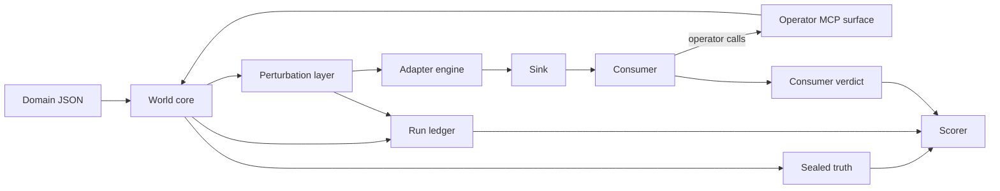

# Architecture overview

> Status: Implemented summary; release posture is conditional. Authority: current Go code and tests, with accepted deviations in `docs/DECISIONS.md`. Verified by: package map and targeted repository review. Last verified: 2026-08-17.

Streams Simulator is a layered Go application. The layers are intentionally boring: domain data enters a world, a delivery layer changes the observer’s evidence, a data-defined adapter renders that evidence, and a sink carries it to a consumer.

## System shape



## Package direction

The intended dependency direction is downward:

```text
cmd/streamsim
    → internal/cli
        → internal/mcp, run, suite, score, refconsumer
            → world, perturb, adapter, sink, truth, domain, model
```

The current implementation keeps ledger behavior inside `internal/run`; there is no separate `internal/ledger` package. That is an implementation detail worth knowing when navigating the code, not a public contract.

## Responsibilities

| Layer | Responsibility | Must not do |
| --- | --- | --- |
| Domain/catalog | Load, validate, digest, and describe JSON domain data. | Add a branch for a particular domain. |
| World | Advance simulation time, evolve state, inject faults, apply effectors, emit native events. | Know a consumer’s schema or interpretation. |
| Perturbation | Transform delivery and preserve a reason for each outcome. | Rewrite director-only world history. |
| Adapter | Project native events into a declared wire format. | Change scenario semantics. |
| Sink | Carry rendered records to in-process, file, or HTTP-push destinations. | Pretend external delivery is deterministic when it is not. |
| MCP | Expose catalog, world control, truth, and operator capabilities. | Carry the event stream as a best-effort control push. |
| Run/artifact | Record commands, counts, ledger, digests, and replay inputs. | Hide incomplete or divergent runs. |
| Truth/scoring | Seal truth, accept verdicts, and compare evidence. | Reveal truth to the consumer before unblind. |

## Data, not code

Domains and adapters are data. The binary should load a new domain or adapter through the same path used by the shipped files. A new consumer should require a new adapter file and possibly an external consumer, not a new consumer-specific branch in `internal/`.

## Source authority

This page is a public summary. Current behavior is owned by the implementation and tests; accepted deviations are in [`docs/DECISIONS.md`](../../docs/DECISIONS.md). The detailed design under [`docs/design/TECHNICAL_DESIGN.md`](../../docs/design/TECHNICAL_DESIGN.md) is a status-labeled archive record, not an override of code or contracts.

## Next reads

- [Pipeline](pipeline.md)
- [Determinism](determinism.md)
- [Security model](security-model.md)
- [Invariants](invariants.md)
