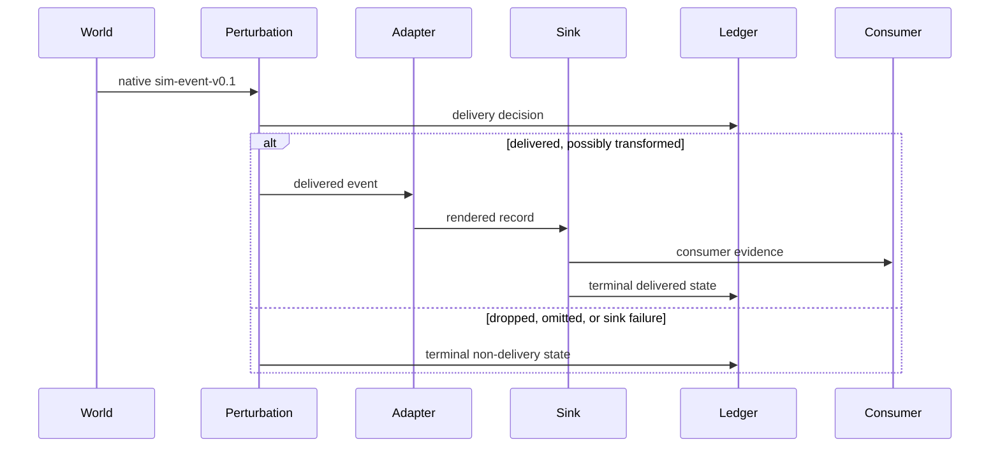

# Event pipeline and delivery ledger

> Status: Implemented summary. Authority: `internal/world`, `internal/perturb`, `internal/adapter`, `internal/sink`, and `internal/run`. Verified by: ledger and adapter tests. Last verified: 2026-08-17.

The pipeline answers one question precisely: what did the world do, and what did the consumer actually receive?

## World truth versus observed evidence

The world records what physically happened in simulation time. Perturbation sits before the adapter so that every consumer sees the same corrupted evidence. The ledger records the delivery instance, sequence, world/entity/channel identifiers, event and observed times, whether it was delivered, and the delivery reason.

This placement prevents a common scoring error: a missing record can be a transport miss, a deliberate omission, a sink error, or a reasoning miss after successful delivery. Those are different failures and must remain different in the evidence.

## Sinks

| Sink | Use | Determinism note |
| --- | --- | --- |
| `inproc` | Tests and local reference paths. | Best for deterministic tests. |
| `file` | JSONL trace and artifact workflows. | Best for replayable local runs. |
| `http-push` | Integration with a receiver process. | External timing and receiver behavior are outside the core determinism boundary. |

## Delivery outcomes

The ledger can distinguish successful delivery from perturbation and transport outcomes. Delayed, duplicated, reordered, rewritten, and mangled records can still be `delivered=true` transformations; dropped, omitted, or sink-error records are `delivered=false` outcomes. Consumers should not infer the reason for an absence from the trace alone; the ledger is the director-side evidence used after the consumer phase.

## Quiescence

When a clock advance requests `await_consumer`, the run waits for the consumer-side work associated with the delivered prefix to settle or marks the run incomplete on timeout. The barrier is a correctness boundary: a run must never silently report success while consumer work is still outstanding.

## Next reads

- [Concepts](../overview/concepts.md)
- [Truth and scoring](truth-and-scoring.md)
- [Replay and debugging](../guides/replay-and-debugging.md)
