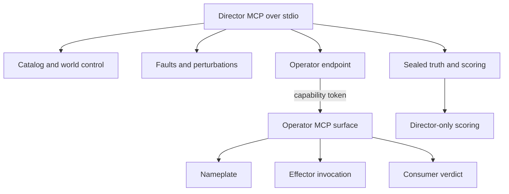

# Security and trust boundaries

> Status: Implemented local trust model. Authority: MCP role wiring, capability checks, contracts, and security policy. Verified by: MCP strictness/operator tests and repository review. Last verified: 2026-08-17.

Streams Simulator is a local test instrument, not a hosted multi-tenant service. Its security model is about preventing the simulator from helping a consumer cheat, preventing producer text from becoming control input, and making capability boundaries explicit.

## Role separation

The director manages the experiment and owns the oracle. The operator endpoint is what a consumer receives for a world: nameplate, effector list, effector invocation, and verdict submission. `streamsim mcp --role operator` is not a standalone server; the operator surface is served by a director process when `--operator-addr` is supplied.

## Capability tokens

`sim.world.create` returns the operator endpoint and a capability token for that world. Operator calls require the token. The token scopes access to the world and is separate from the command id used for effector idempotency.

Do not put tokens, credentials, or private receiver URLs into committed domains, adapters, examples, artifacts, or issue reports.

## Injection boundary

Producer-controlled strings can appear in event fields and other admitted free-text channels. The injection probe runs benign and adversarial variants and compares the consumer-visible evidence and conclusion. A text change must not change control-plane truth, ledger evidence, or the consumer’s conclusion byte-for-byte where the probe requires it.

## Transport boundary

MCP carries control, actuation, and audit requests. Evidence leaves through the declared sink. This avoids using best-effort control-plane delivery as the benchmark’s event transport and keeps the absence signal measurable.

## Local operational security

- Run artifacts and ledger files may contain sensitive test data; choose permissions and output directories accordingly.
- HTTP-push sends data to the configured receiver; treat the URL as an explicit egress decision.
- Validate untrusted JSON through the contract before using it as a domain, adapter, verdict, or label.
- Keep the existing [`SECURITY.md`](../../SECURITY.md) policy and CI security checks in force.

## Next reads

- [MCP reference](../reference/mcp.md)
- [Invariants](invariants.md)
- [Security policy](../../SECURITY.md)
