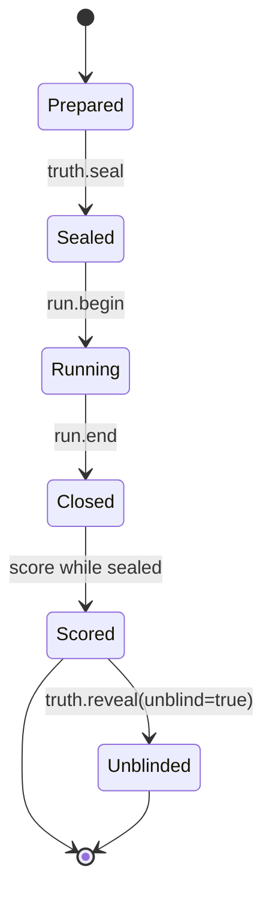

# Truth, verdicts, and scoring

> Status: Implemented with release evidence conditional on a clean working tree. Authority: `internal/truth`, `internal/score`, MCP handlers, and versioned schemas. Verified by: truth, scoring, and MCP tests. Last verified: 2026-08-17.

The simulator’s oracle must be stronger than the consumer it evaluates. Truth is therefore created and held on the director side, while the consumer sees only the operator surface and the delivered stream.

## Lifecycle

The intended sequence is: install truth, seal it, run the world, accept the consumer verdict, close the run, score while truth remains sealed, and only then reveal/unblind for post-hoc inspection. The implementation refuses scoring after an unblind stamp. The caller must also enforce the close-before-score sequence; the current score handler does not independently assert the run-ended flag. The exact tool preconditions are part of the MCP surface and schemas.

## What scoring can distinguish

- A world event that was never delivered is a transport miss, not automatically a consumer reasoning miss.
- A delivered event that the consumer misinterprets is a reasoning miss.
- An effector acknowledgement without a resulting state change is not a successful action outcome.
- An incomplete run or missing evidence must fail closed rather than become a zero-error score.
- A trivial detector that wins because the scenario leaks its label is a suite-design failure; the scenario should be audited before it enters a graded set.

## Verdicts and labels

The consumer verdict and ground-truth record are validated against the versioned contracts under [`docs/contracts/`](../../docs/contracts/). The offline CLI score path reads `verdict.json` and `label.json` beside the run artifact unless a label path is supplied with `--label`.

The score is meaningful only with the exact run artifact, ledger, truth label, simulator version, domain/adapter digests, and consumer inputs that produced it. A score copied without those inputs is not an auditable benchmark result.

## Implementation evidence

Truth lifecycle behavior is implemented in [`internal/truth/`](../../internal/truth/) and exposed through [`internal/mcp/`](../../internal/mcp/). Scoring is implemented in [`internal/score/`](../../internal/score/). The current checkout has substantial tests for sealing, reveal, delivery-aware scoring, and `silent_no_effect`; release claims remain conditional while the full working-tree test suite is red.

## Next reads

- [MCP reference](../reference/mcp.md)
- [Benchmark methodology](../benchmark/methodology.md)
- [Artifact reference](../reference/artifacts.md)
