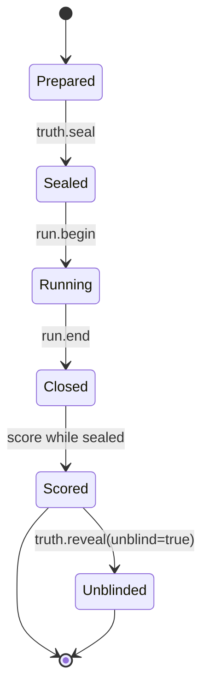

# Truth, verdicts, and scoring

> Status: Implemented; release evidence remains conditional. Authority: `internal/truth`, `internal/score`, MCP handlers, and versioned schemas. Verified by: truth, scoring, MCP and online/offline parity tests. Last verified: 2026-10-03.

The simulator’s oracle must be stronger than the consumer it evaluates. Truth is therefore created and held on the director side, while the consumer sees only the operator surface and the delivered stream.

## Lifecycle

```mermaid
stateDiagram-v2
    [*] --> Prepared
    Prepared --> Sealed: truth.seal
    Sealed --> Running: run.begin
    Running --> Closed: run.end
    Closed --> Scored: score while sealed
    Scored --> Unblinded: truth.reveal(unblind=true)
    Scored --> [*]
    Unblinded --> [*]
```

The intended sequence is: install truth, seal it, run the world, accept the consumer verdict, close the run, score while truth remains sealed, and only then reveal/unblind for post-hoc inspection. The implementation refuses scoring after an unblind stamp. The caller must also enforce the close-before-score sequence; the current score handler does not independently assert the run-ended flag. The exact tool preconditions are part of the MCP surface and schemas.

## What scoring can distinguish

- A world event that was never delivered is a transport miss, not automatically a consumer reasoning miss.
- A delivered event that the consumer misinterprets is a reasoning miss.
- An effector acknowledgement without a resulting state change is not a successful action outcome.
- An incomplete run or missing evidence must fail closed rather than become a zero-error score.
- A trivial detector that wins because the scenario leaks its label is a suite-design failure; the scenario should be audited before it enters a graded set.

## Verdicts and labels

The consumer verdict and ground-truth record are validated against the versioned contracts under [`docs/contracts/`](../../docs/contracts/). The offline CLI score path reads `verdict.json` and `label.json` beside the run artifact unless a label path is supplied with `--label`.

The score is meaningful only with the exact run artifact, ledger, truth label, simulator version, domain/adapter digests, and consumer inputs that produced it. A score copied without those inputs is not an auditable benchmark result.

## Implementation evidence

The scoring bundle `scorecard-bundle-v0.2` uses shared online/offline policies for judgment, delivery admission, evidence grounding and action fidelity. Judgment selects the earliest detection regardless of verdict ordering. Identity-conflict handling requires a reported conflict admission when identity reuse applies; appropriate-action credit requires the scenario entity. Malformed citations fail grounding in both paths. Online resolution and deadline metrics still require world history and are not inferred by the offline path. An unavailable offline ledger produces conservative zero metrics; an available empty ledger retains the existing vacuous-success convention. These metric corrections retain the JSON field layout.

Truth lifecycle behavior is implemented in [`internal/truth/`](../../internal/truth/) and exposed through [`internal/mcp/`](../../internal/mcp/). Scoring is implemented in [`internal/score/`](../../internal/score/), with [online/offline parity regressions](../../internal/score/internal/domain/shared_policy_test.go). Local test evidence and remaining release risks are recorded in the [refactoring review](../../docs/refactoring/clean-code-20261002/REVIEW.md); passing tests do not establish complete offline evidence validation or release readiness.

## Next reads

- [MCP reference](../reference/mcp.md)
- [Benchmark methodology](../benchmark/methodology.md)
- [Artifact reference](../reference/artifacts.md)
